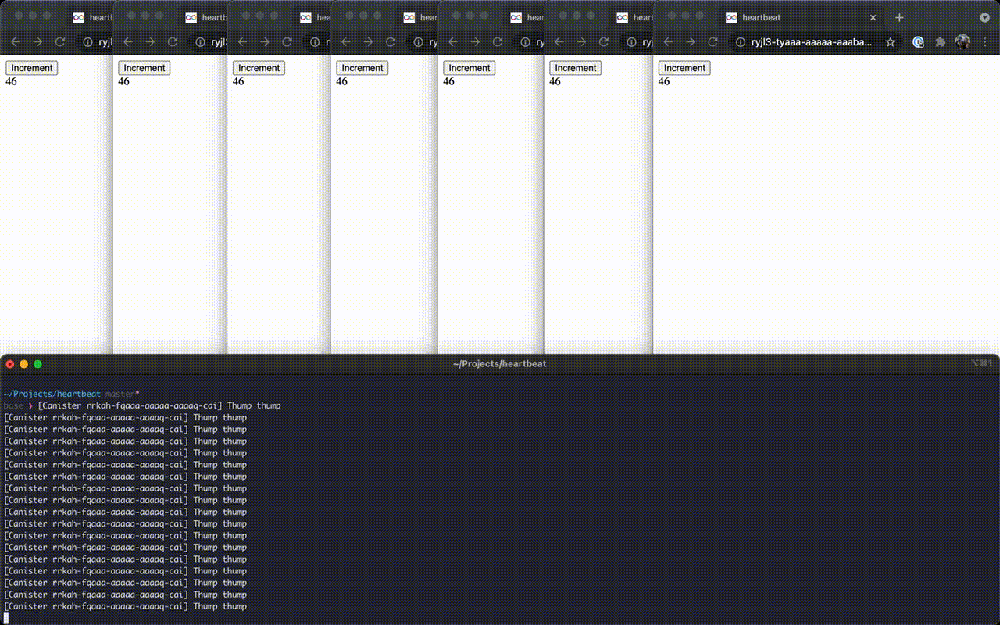

# Heartbeat



`canister_heartbeat` is coming, but it's probably not reliable enough for the hackathon. In this implementation, the frontend periodically calls the `canister_heartbeat` method, and the canister debounces those calls to run on the desired interval.

Try it out:

```shell
dfx start &
dfx deploy
```

Then open it up in chrome.

Running on mainnet here: https://icyrf-qqaaa-aaaah-qax2a-cai.raw.ic0.app/

**Note:**

I'm a little concerned about the time travel that can appear to happen between systems in a subnet. Let's keep an eye on that.
